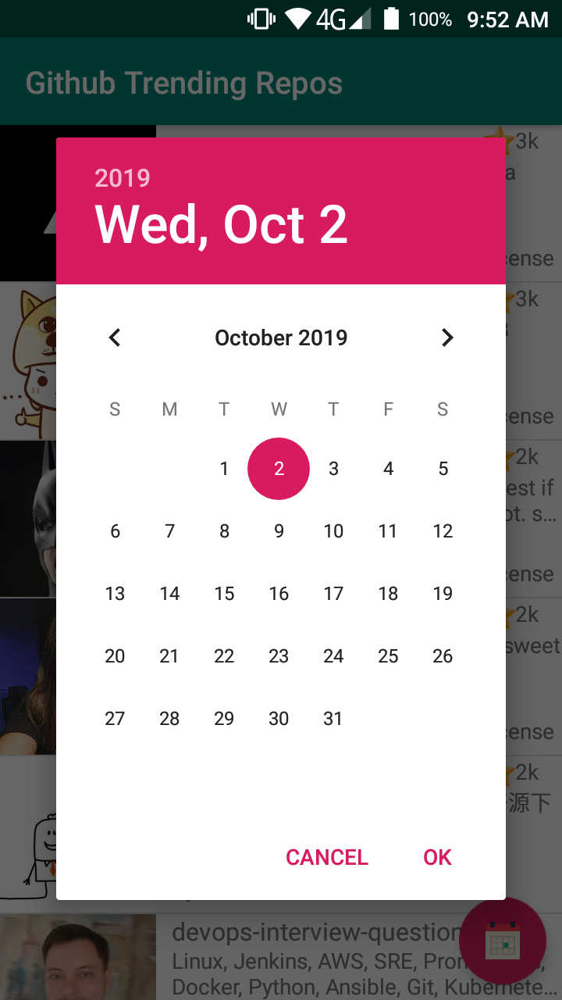

# Github Trending Repos Android App

This is a simple Android App that uses the Github API to retreive and search for the most starred reops created since a spesific date. The date can be changed manually by the user. 

## Screenshots

[](screenshots/screenshot1.png)
[](screenshots/screenshot2.png)
[](screenshots/screenshot3.png)

## Setup
Clone this repository and import into **Android Studio**
```bash
git clone https://github.com/islem19/Github-Trending-Repos-Android-App.git
```

## Permissions
The App requires the following permissions:
- Internet access.
- Access to WiFi state.
- Access to Network state.

## Libraries and Dependencies
- [Retrofit](https://square.github.io/retrofit/)
- [Picasso](https://square.github.io/picasso/)
- [RecyclerView](https://developer.android.com/jetpack/androidx/releases/recyclerview)
- Material Design -[Floating Action Button](https://material.io/develop/android/components/floating-action-button/)-


## Maintainers
This project is mantained by:
* [Abdelkader Sellami](https://github.com/islem19)


## Contributing

1. Fork it
2. Create your feature branch (git checkout -b my-new-feature)
3. Commit your changes (git commit -m 'Add some feature')
4. Push your branch (git push origin my-new-feature)
5. Create a new Pull Request


## License
This application is released under GNU GPLv3 (see [LICENSE](https://github.com/islem19/Github-Trending-Repos-Android-App/blob/develop/LICENSE)). Some of the used libraries are released under different licenses.
